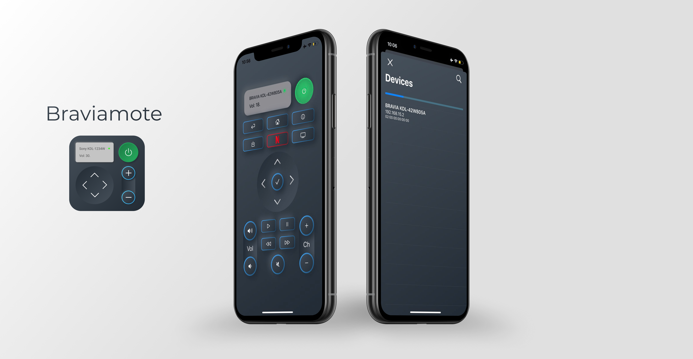

# Braviamote
> #2 Personal Swift Project 

A TV remote controller for Sony Bravia models made with SwiftUI

## Usage example

Download the project, open the file `Braviamote.xcworkspace`with Xcode and run!

## Features

* Layout with SwiftUI
* API usage
* LAN scanning
* Wake up TV by Mac address
* Core Data for saving TV info
